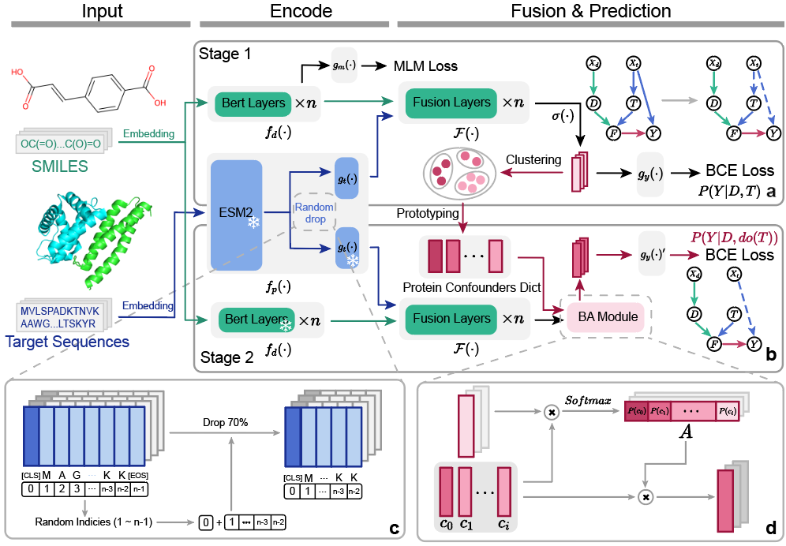

# TAPB: An Interventional Debiasing Framework for Alleviating Target Prior Bias in Drug-Target Interaction Prediction

This repository contains the PyTorch implementation of **TAPB**，which aims to alleviating target prior bias in DTI prediction.

## Framework



## System Requirements

The source code was developed in Python 3.8 using PyTorch 1.7.1. The required python dependencies are given below. TAPB is supported for any standard computer and operating system (Windows/macOS/Linux) with enough RAM to run. There is no additional non-standard hardware requirements.

```
torch>=1.7.1
numpy>=1.20.2
scikit-learn>=0.24.2
pandas>=1.2.4
prettytable>=2.2.1
rdkit~=2021.03.2
transformers
```

## Datasets

The `datasets` folder contains all experimental data used in TAPB: [BindingDB](https://github.com/peizhenbai/DrugBAN), [BioSNAP](https://github.com/kexinhuang12345/MolTrans)

## Run TAPB on Our Data to Reproduce Results

To train TAPB, where we provide the basic configurations for all hyperparameters in `model_config.yaml` and 'train_config.yaml'.

To accelerate the training process and reduce GPU memory usage, we pre-extract and save the target features for each dataset using ESM-2. The weights for ESM-2 can be downloaded from [Hugging Face](https://huggingface.co/facebook/esm2_t33_650M_UR50D). In `generate_pr_feature.py`, you can specify your dataset of interest.

```
$ python generate_pr_feature.py
```

For the in-domain experiments, you can directly run the following command for 2 stage interventional training. `${dataset}` could either be `bindingdb`, `biosnap`.

```
$ python main.py --data ${dataset} --split "random"
```

For the cross-domain experiments, you can directly run the following command for 2 stage interventional training. `${dataset}` could be either `bindingdb`, `biosnap`.

```
$ python main.py --data ${dataset} --split "cluster"
```

For the single-stage testing, you can change the settings in `main_single_stage.py` and run the following command. `${dataset}` could be either `bindingdb`, `biosnap`. `${split}` could be `random`, `cluster`. 

```
$ python main_single_stage.py --data ${dataset} --split  ${split}
```

fully codes will be uploaded in several hours, our server is under maintenance
